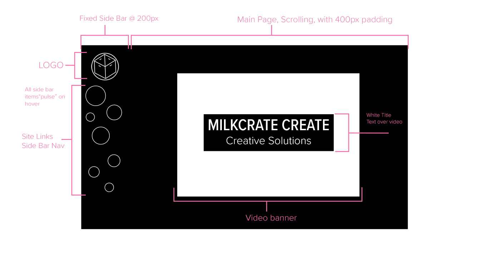

#Assignment 11 Readme
1. Padding is the distance between the content and the border, a border surrounds the content, and the margin is the distances between the border and the container or parent.
2. 
3. Unchartered...ish territories. Having never done assignment 11 before I hesitated, and procrastinated. Then I made a pot of coffee, drank it, read the website. And dug in. Was surprised to not find any code pen examples with a side bar... but all the info was there. Almost watched the walkthrough, then remembered Justine's email, felt like I could do it without it, and I would be better off.
